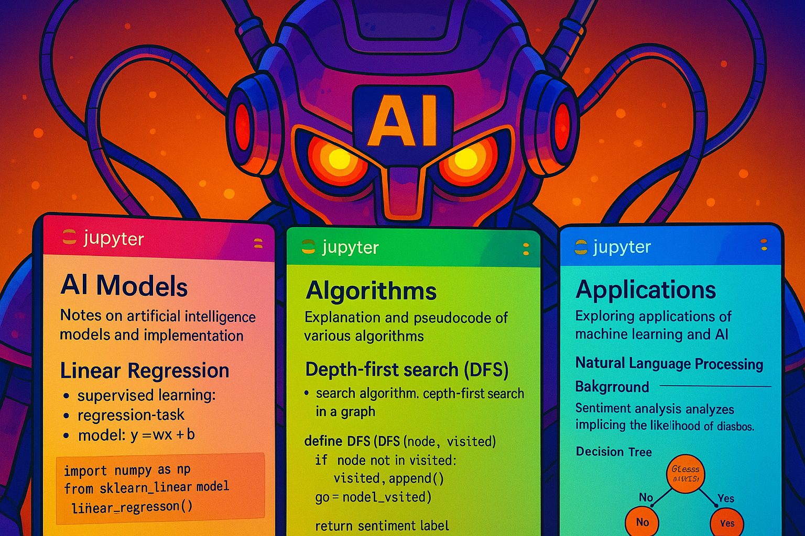

# AI notebooks

Some jupyter notebooks containing notes and implementation of AI **models**, **algorithms**, & **applications**. Or generally AI / ML related stuff like chess engines. Ultimately, our goal is to learn how to build performant, computationally efficient, sustainable, and [aligned](https://en.wikipedia.org/wiki/AI_alignment) intelligent systems: 🤖 = 🧠 + ⌛ + ♻️ + 🚃.



## venv

The venv used to run the notebooks can be re-created easily using [uv](https://docs.astral.sh/uv/getting-started/installation/):

```bash
uv venv --python 3.13
uv sync
```

**NOTE:** You may have to add the `.venv` as ipykernel in JupyterLab:
```bash
uv add ipykernel
uv run python -m ipykernel install --user --name=ai-notebooks
```


## the notebooks

The notebooks for each topic can be found in separate folders in the `/topics` directory:

| **Topic** | **Folder** | **Primary Reference(s)** |
| :-- | :-- | :-- |
| [Deep Learning Systems](/topics/dlsys/) | `/dlsys` | [CMU 10-414/714: Deep Learning Systems](https://dlsyscourse.org/lectures/) (Fall 2024) |
