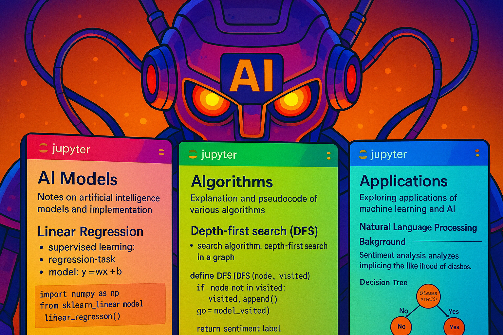

# AI notebooks

Jupyter notebooks containing notes and implementation of **AI models**, **algorithms**, & **applications**.



## venv

The venv used to run the notebooks can be re-created easily using [uv](https://docs.astral.sh/uv/getting-started/installation/):

```bash
git clone git@github.com:particle1331/ai-notebooks.git && cd ai-notebooks
make venv
```

You can also install requirements via `pip` (without using `uv` as dependency manager):
```bash
# install required python version, pip, and activate venv
make uv
uv python install 3.13
uv venv .venv && source .venv/bin/activate
curl -sS https://bootstrap.pypa.io/get-pip.py | .venv/bin/python

# install requirements on venv
make requirements
uv pip install -r requirements.txt
uv pip install -e .
```

:::{.callout-tip}
See [here](/topics/tooling/runpod.html) where we setup a remote environment from scratch.
:::

<!-- **NOTE:** You may have to add the `.venv` as ipykernel in JupyterLab:
```bash
uv add ipykernel
uv run python -m ipykernel install --user --name=ai-notebooks
``` -->


## the notebooks

The notebooks are located in [`/notebooks`](https://github.com/particle1331/ai-notebooks/tree/main/notebooks) under separate directories for each topic.
<!-- 
| **Topic** | **Folder** | **Primary Reference(s)** |
| :-- | :-- | :-- |
| [Deep Learning](/topics/deep/) | `/deep` | [CMU 10-414/714: Deep Learning Systems](https://dlsyscourse.org/lectures/) (Fall 2022) | -->
