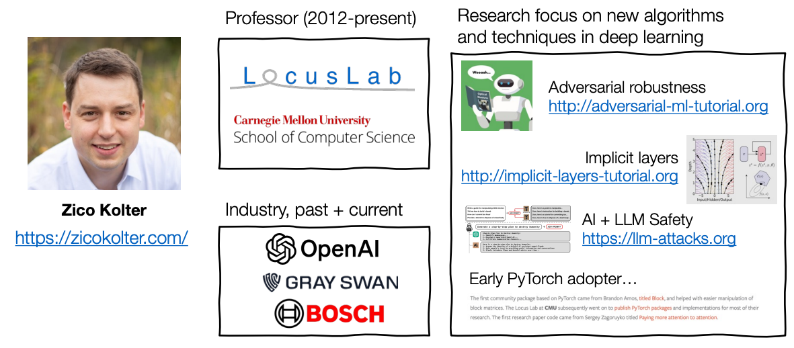
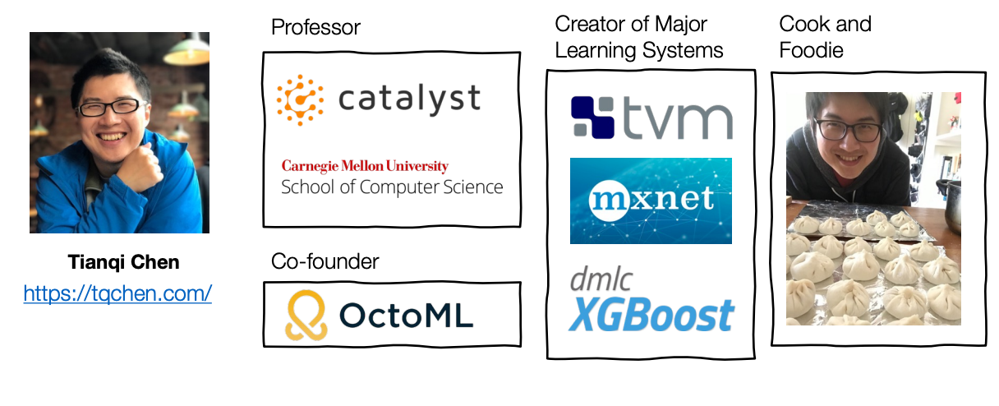

# Deep Learning Systems

**Primary reference:** 
[CMU 10-414/714: Deep Learning Systems](https://dlsyscourse.org/lectures/)
- Fall 2024
- Instructors: [J. Zico Kolter](https://zicokolter.com/) and [Tianqi Chen](https://tqchen.com/)

This course will provide you will an introduction to the functioning of modern deep
learning systems. You will learn about the underlying concepts of modern deep learning systems like
automatic differentiation, neural network architectures, optimization, and efficient
operations on systems like GPUs. 

Finally, to solidify understanding, the homeworks build
from scratch **needle** &mdash; a deep learning library loosely similar to PyTorch, and
implement many common architectures in the library.

## Contents

- [01 Introduction](./01.ipynb)
- [02 Softmax Regression](./02.ipynb)
- [03 "Manual" Neural Networks](./03.ipynb)

## Prerequisites

- Systems programming 
- Linear algebra
- Other mathematical background: e.g., calculus, probability, basic proofs
- Python and C++ development ([C++ crash course](https://www.youtube.com/watch?v=9Myk2vcK8s8))
- Prior experience with basic ML (overfitting, model validation)

## Learning objectives

- Understand the basic functioning of modern deep learning libraries
- Including
concepts like automatic differentiation, gradient-based optimization
- Be able to implement several standard deep learning architectures
- MLPs, ConvNets, RNNs, Seq2Seq, Transformers, truly from scratch
- Understand how hardware acceleration (e.g., on GPUs) works under the hood
- Be able to develop your own highly efficient code for modern DL

## Course instructors

